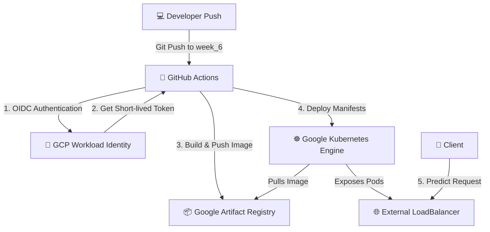

# 🚀 IRIS ML Pipeline: Continuous Deployment to GKE

[](https://fastapi.tiangolo.com/)
[](https://www.docker.com/)
[](https://kubernetes.io/)
[](https://cloud.google.com/)
[](https://github.com/features/actions)

An automated **Continuous Deployment (CD) pipeline** that packages the IRIS machine learning inference API into a Docker container, stores it in **Google Artifact Registry (GAR)**, and deploys it to a **Google Kubernetes Engine (GKE)** cluster.

The pipeline utilizes **Workload Identity Federation (WIF)** for secure, keyless authentication, completely avoiding the security risks of long-lived JSON service account keys.

---

## 📌 Architecture & Workflow



---

## 📂 Project Structure

```text
.
├── .github/
│   └── workflows/
│       └── cd.yaml             # GitHub Actions CI/CD pipeline
├── k8s/
│   ├── deployment.yaml         # Kubernetes Deployment manifest (replicas, port 8000)
│   └── service.yaml            # Kubernetes LoadBalancer Service manifest
├── Dockerfile                  # Multi-stage optimized Docker configuration
├── main.py                     # FastAPI application serving ML predictions
├── requirements.txt            # Python dependencies (FastAPI, scikit-learn, etc.)
├── README.md                   # Detailed project documentation (this file)
├── api_response.txt            # Verification: Sample prediction response via curl
├── pods_output.txt             # Verification: Log showing running Kubernetes pods
└── services_output.txt         # Verification: Log showing running services with external IP
```

---

## 🛠️ Components & Configuration

### 1. FastAPI Inference API (`main.py`)
Exposes two main HTTP endpoints to serve predictions from the trained IRIS classification model:
- **`GET /`**: Health status check.
  ```json
  { "status": "healthy", "message": "Iris API is running on GKE!" }
  ```
- **`POST /predict`**: Infer species based on flower dimensions.
  - **Request Body (JSON)**: `sepal_length`, `sepal_width`, `petal_length`, `petal_width`
  - **Response**: The predicted species name (*Iris Setosa*, *Iris Versicolor*, or *Iris Virginica*).

### 2. Containerization (`Dockerfile`)
- Uses Python `3.10-slim` base image to maintain a minimal container size.
- Installs necessary libraries listed in `requirements.txt`.
- Exposes port `8000` for application traffic.
- Boots up the FastAPI web server using Uvicorn.

### 3. Kubernetes Orchestration (`k8s/`)
- **Deployment (`deployment.yaml`)**: Runs the IRIS API container, handles replications, and manages rolling updates for zero-downtime deployment.
- **Service (`service.yaml`)**: Provisions a public-facing **External LoadBalancer** routing public HTTP traffic to the underlying GKE Pods on port 8000.

### 4. CI/CD Automation (`.github/workflows/cd.yaml`)
Automates the build-push-deploy lifecycle:
1. **Trigger**: Git push events to the `week_6` branch.
2. **Authenticate**: Logs into Google Cloud using OIDC-based Workload Identity Federation.
3. **Build**: Packages the code and environment into a Docker container.
4. **Push**: Uploads the tagged container image to **Google Artifact Registry**.
5. **Credentials**: Automatically configures `kubectl` context to interface with the GKE cluster.
6. **Deploy**: Applies the manifests to the cluster and initiates a rolling restart of the deployment to apply changes instantly.

### 5. Verification Output Files
*   **`pods_output.txt`** — Log output confirming successfully running Kubernetes pods.
*   **`services_output.txt`** — Output detailing the active service endpoint mapping.
*   **`api_response.txt`** — Captured live API execution payloads matching verification tests.

---

## 🔐 Security: Keyless GCP Authentication

Rather than storing long-lived, highly privileged service account JSON keys inside the repository, this project utilizes **Workload Identity Federation**:
* **Identity Provider Integration**: GitHub Actions acts as an Identity Provider (IdP) via OpenID Connect (OIDC).
* **Security Token Exchange**: Google Cloud exchanges GitHub's secure, short-lived OIDC tokens for temporary Google Cloud IAM credentials.
* **Least Privilege**: Deployment permissions are limited to the exact repository and the specific build/deploy operations.

---

## 🛑 Troubleshooting & Challenges

| Challenge | Root Cause | Resolution |
| :--- | :--- | :--- |
| **GCP SA Key Blocked** | Organization policy prevented JSON service account key creation. | Migrated the pipeline authentication to **Workload Identity Federation** (OIDC). |
| **GitHub Actions Auth Failure** | GitHub workflow lacked permissions to request the OIDC token. | Added `permissions: { contents: read, id-token: write }` block. |
| **Docker Build Failure** | `requirements.txt` was not in the expected path. | Relocated `requirements.txt` to the project root and committed. |
| **Registry Permission Denied** | Workload Identity Service Account lacked write permissions for GAR. | Granted the `Artifact Registry Writer` role to the Service Account. |
| **WIF Misconfiguration** | Incorrect Provider / Pool ID path referenced in GHA step. | Verified path configurations and updated provider paths in GHA secrets. |

---

## 📊 Verification & Validation

The successful execution of the continuous deployment was verified using the outputs generated during deployment:
1. **GitHub Actions execution**: Confirmed with a green build status in the Actions tab.
2. **Running Kubernetes Pods**: Verified using `kubectl get pods` (captured in [pods_output.txt](file:///c:/Users/ansh1/Documents/Desktop/app%20test/pods_output.txt)).
3. **Kubernetes Services**: LoadBalancer and external IP status checked using `kubectl get services` (captured in [services_output.txt](file:///c:/Users/ansh1/Documents/Desktop/app%20test/services_output.txt)).
4. **Endpoint validation**: Validated with a prediction request sent to the external IP using `curl` (captured in [api_response.txt](file:///c:/Users/ansh1/Documents/Desktop/app%20test/api_response.txt)).

---

## 🎓 Learning Outcomes

* **Docker containerization** for deploying python FastAPI models.
* **Kubernetes orchestration** (managing Pods, Deployments, Services, and LoadBalancers).
* **GCP cloud architecture** using Google Kubernetes Engine (GKE) and Google Artifact Registry (GAR).
* **Security best practices** including IAM roles, keyless Workload Identity Federation, and Least Privilege principles.
* **Automated CI/CD workflows** with GitHub Actions.

---
