# 🚀 MLOps Week 4: Continuous Integration for the IRIS Pipeline

[](https://www.python.org/)
[](https://github.com/features/actions)
[](https://dvc.org/)
[](https://cloud.google.com/)
[](https://cml.dev/)

---

## 👤 Student Information

| Field | Details |
| :--- | :--- |
| **Student Name** | Devansh Gupta |
| **Roll Number** | `22f3002843` |
| **Course** | IIT Madras BS Degree – MLOps Weekly Assignment |
| **Git Branch** | `week_4` |

---

## 🎯 Assignment Objective

The core objective of this assignment is to integrate **Continuous Integration (CI)** into the IRIS Machine Learning pipeline using **GitHub Actions** and **DVC**. 

Whenever code is pushed or a Pull Request (PR) is created, the CI pipeline automatically:
1. 📥 **Retrieves** version-controlled datasets and models using DVC.
2. 🔍 **Validates** the incoming data.
3. 📊 **Evaluates** the trained model against standard metrics.
4. 📄 **Generates** a markdown test and evaluation report.
5. ✉️ **Publishes** the report directly to the PR using CML (Continuous Machine Learning).
6. 🚫 **Prevents** broken or degraded code/models from being merged into production.

This ensures that every single code change is automatically verified for data integrity and model quality before reaching the production branch.

---

## 📁 Repository Structure

```directory
.
├── .github/
│   └── workflows/
│       └── ci.yaml             # GitHub Actions CI workflow config
├── .dvc/                       # DVC configuration folder
├── tests/
│   └── test_pipeline.py        # Automated unit tests (data & model)
├── train.py                    # Decision Tree classifier training script
├── inference.py                # Model prediction/inference script
├── prepare_data.py             # Data ingestion & splitting script
├── requirements.txt            # Python dependencies (pinned versions)
├── train.csv.dvc               # DVC pointer for training dataset
├── eval.csv.dvc                # DVC pointer for evaluation dataset
├── model.joblib.dvc            # DVC pointer for trained model
├── model_eval.joblib.dvc       # DVC pointer for evaluation model
├── .dvcignore                  # Files to ignore in DVC tracking
├── .gitignore                  # Files to ignore in Git tracking
└── README.md                   # Project documentation
```

---

## ⚙️ Utility of Each File

<details open>
<summary><b>📂 Pipeline Configuration & Scripts</b></summary>

### 🛠️ `.github/workflows/ci.yaml`
The orchestration hub for the GitHub Actions runner. It executes the entire CI pipeline:
* Triggers automatically on every `Push` and `Pull Request`.
* Checks out the repository and configures the Python environment.
* Authenticates securely with Google Cloud Platform (GCP) using **Workload Identity Federation**.
* Pulls versioned datasets and model files from GCP Storage using **DVC**.
* Runs the automated test suite via `pytest`.
* Generates a markdown performance report and uses **CML** to post it as a comment on the active PR.

### 🧪 `tests/test_pipeline.py`
Automated assertions to safeguard the pipeline's stability:
* **Data Validation:** Checks that the evaluation dataset exists, is non-empty, contains no missing values, adheres to the expected schema, and has the correct number of columns.
* **Model Validation:** Checks that the trained model exists, loads properly, executes inference, and achieves prediction accuracy exceeding the minimum threshold.
* *Note: The pipeline fails immediately if any data sanity check fails or if model accuracy falls below the set threshold.*

### 🚂 `train.py`
Trains a Decision Tree Classifier using the designated training dataset and outputs the serialized model (`model.joblib`) ready for deployment.

### ✂️ `prepare_data.py`
Reads raw data, splits it into training and evaluation sets, and saves them as versioned CSV files.

### 🔮 `inference.py`
Loads the trained classifier model and performs predictions on the evaluation dataset.

### 📋 `requirements.txt`
Declares the Python dependencies needed to build, test, and run the pipeline. Key packages include:
* `pandas`, `numpy`, `scikit-learn` (explicitly pinned to `1.3.2` for backwards compatibility with Week 2 artifacts).
* `pytest` (testing framework).
* `dvc`, `dvc-gs`, `dvc[gcs]` (DVC CLI and Google Cloud Storage support).
* `cml` (Continuous Machine Learning).
</details>

<details open>
<summary><b>📦 Data Version Control (DVC) Artifacts</b></summary>

### 📎 DVC Pointer Files (`*.dvc`)
* `train.csv.dvc`, `eval.csv.dvc`, `model.joblib.dvc`, `model_eval.joblib.dvc`
* These lightweight text files store the hash (md5) of the actual large files. Rather than cluttering Git history, the datasets and models reside in Google Cloud Storage, while Git tracks only these pointers.
* **Advantages:** Minimal Git repo footprint, precise dataset versioning, reproducible experiments, and clean model tracking.

### ⚙️ `.dvc/`, `.gitignore`, & `.dvcignore`
* **`.dvc/`**: Stores internal configurations (e.g., GCP bucket remote URL, cache directory).
* **`.gitignore` & `.dvcignore`**: Ensure raw files (like `.csv` or `.joblib` objects) are never committed to Git, keeping local files and version controls distinct.
</details>

---

## 🔄 Continuous Integration Workflow

```mermaid
graph LR
    Developer([Developer Push / PR]) --> Git[GitHub Remote Repository]
    Git --> GA[GitHub Actions Runner]
    
    subgraph CI Runner Execution
        GA --> Checkout[1. Checkout Repository]
        Checkout --> Setup[2. Install Python Dependencies]
        Setup --> Auth[3. Authenticate with GCP via OIDC]
        Auth --> DVCPull[4. Pull Datasets/Models via DVC]
        DVCPull --> Tests[5. Run Pytest Suite]
        Tests --> Report[6. Generate Markdown Evaluation Report]
        Report --> CML[7. Publish Report to PR via CML]
    end

    CML --> Decision{Tests Pass?}
    Decision -->|Yes| Merge[Allow PR Merge]
    Decision -->|No| Block[Block PR Merge / Alert Developer]

    style Decision fill:#f9f,stroke:#333,stroke-width:2px
    style Merge fill:#d4edda,stroke:#28a745,stroke-width:2px
    style Block fill:#f8d7da,stroke:#dc3545,stroke-width:2px
```



---

## 🛠️ Stack & Technologies Used

| Category | Technologies |
| :--- | :--- |
| **Google Cloud Platform** | GCP, Google Cloud Storage (GCS), Cloud Shell, IAM, Workload Identity Federation, Service Accounts |
| **GitHub Technologies** | GitHub Actions, Pull Requests, GitHub Secrets, GitHub OIDC Authentication |
| **MLOps & Testing** | DVC (Data Version Control), Git, Pytest, CML (Continuous Machine Learning) |
| **Data & Modeling** | Python, Pandas, Numpy, Scikit-Learn |

---

## 🔒 Security Implementation

Instead of storing a long-lived, high-risk JSON Service Account Key inside GitHub Secrets, this project implements **Workload Identity Federation**.

### 🤝 Keyless Authentication via OIDC
GitHub Actions authenticates directly with GCP using OpenID Connect (OIDC) tokens.

> 💡 **Note: Key Security Benefits**
> * **Keyless Authentication:** No long-lived service account credentials stored in GitHub.
> * **Short-Lived Tokens:** Access is granted on-the-fly and expires immediately after the job finishes.
> * **Granular Access Control:** Restricted strictly to the resources required by the runner.
> * **Zero Exposure Risk:** Eliminates the risk of leaked JSON keys.
> * **GCP Best Practice:** Follows the recommended standard for enterprise-grade cloud integrations.

---

## ⚠️ Challenges Faced & Solutions

During implementation, several real-world MLOps integration challenges were encountered and successfully resolved:

### 1. Workload Identity Federation Authentication Error

> ⚠️ **Warning:** GitHub Actions was unable to authenticate with GCP, resulting in token exchange errors. This was caused by an incorrect attribute mapping configuration in GCP.

**Solution:** Corrected the Workload Identity Provider mapping. Updated the attribute mapping configuration to correctly map the token subject:
```yaml
google.subject = assertion.sub
```

### 2. Missing DVC Google Storage Backend

> ⚠️ **Warning:** When running the DVC pull command on the Actions runner, it failed with the error: `No module named dvc_gs`.

**Solution:** Explicitly added the GCP storage provider dependencies for DVC in `requirements.txt`:
```txt
dvc
dvc-gs
dvc[gcs]
```

### 3. Scikit-Learn Version Mismatch

> ⚠️ **Warning:** The evaluation script threw the error: `AttributeError: DecisionTreeClassifier has no attribute monotonic_cst`. This happened because the model artifact was trained and serialized during Week 2 using an older version of Scikit-Learn, but the GitHub Actions runner was installing the latest version by default, causing serialization incompatibilities.

**Solution:** Pinned the exact Scikit-Learn version in `requirements.txt`:
```txt
scikit-learn==1.3.2
```

---

## 💡 Learning Outcomes

Through this assignment, I have acquired hands-on experience in:
* [x] **Designing Robust CI Pipelines** tailored for machine learning workflows.
* [x] **Writing Automated Tests** using `pytest` for validating data sanity and model accuracy.
* [x] **Integrating GitHub Actions with DVC** to download and manage data/models dynamically in CI runners.
* [x] **Configuring Google Cloud Authentication** securely using Workload Identity Federation.
* [x] **Publishing Dynamic CI Reports** directly onto GitHub PRs using CML.
* [x] **Establishing Dependency Pinning Standards** to prevent run-time serialization discrepancies.
* [x] **Leveraging Versioned Data/Models** inside remote storage to build fully reproducible experiments.
* [x] **Applying Industry-Standard MLOps Principles** to bridge the gap between ML models and software engineering.

---

## ✅ Completed Tasks

- [x] Implement automated data validation test cases.
- [x] Implement automated model validation test cases.
- [x] Configure the GitHub Actions workflow (`ci.yaml`).
- [x] Set up Google Cloud Storage and integrate it with DVC.
- [x] Create and configure GCP Service Accounts and IAM permissions.
- [x] Set up and configure Workload Identity Federation.
- [x] Enable keyless authentication in GitHub Actions.
- [x] Configure automated CI triggers on Push & Pull Requests.
- [x] Integrate CML to generate and comment reports on Pull Requests.
- [x] Establish a branch protection & PR-based merge workflow.

---

## 🔮 Future Improvements

Here are the planned improvements to extend the pipeline's capabilities:
* 🐳 **Dockerization:** Containerize the CI runtime environment to ensure environment consistency.
* 🗃️ **Model Registry:** Integrate a model registry (like MLflow) to version and transition model states.
* 🚀 **Continuous Deployment (CD):** Deploy the model automatically to a staging/production endpoint after a successful CI build.
* 🔄 **Continuous Training (CT):** Establish automated retraining pipelines triggered by data drift.
* 📈 **Model Drift Monitoring:** Implement monitoring tools to track model performance decay in production.
* 🔔 **Instant Alerts:** Set up Slack or email notifications for build failures.
* 🗺️ **Multi-Environment Testing:** Execute tests against multiple python versions and operating systems.

---

## 🏁 Conclusion

This assignment successfully transformed the static IRIS classification project into a robust, production-ready, and fully reproducible MLOps pipeline.

By combining **GitHub Actions**, **DVC**, **CML**, automated testing, and secure authentication via **Workload Identity Federation**, every code and model update is automatically tested, documented, and verified. This pipeline ensures maximum reliability, security, and reproducibility under modern MLOps best practices.
