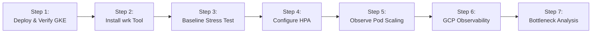

<div align="center">

# 🚀 Week 7 – Stress Testing, Observability & Scaling the IRIS Pipeline

[](https://cloud.google.com/)
[](https://kubernetes.io/)
[](https://www.docker.com/)
[](https://www.python.org/)
[](https://flask.palletsprojects.com/)
[](https://github.com/features/actions)

<p align="center">
  <b>Automated CI/CD Deployment, Workload Identity Authentication, High-Concurrency Load Testing with <code>wrk</code>, Kubernetes Horizontal Pod Autoscaling (HPA), and Real-Time Observability using Google Cloud Platform.</b>
</p>

---

</div>

## Table of Contents

- 📖 [Overview](#overview)
- 🎯 [Assignment Objectives](#assignment-objectives)
- 🛠️ [Technologies Used](#technologies-used)
- 📁 [Repository Structure](#repository-structure)
- 📄 [Utility of Each File](#utility-of-each-file)
- 🔄 [Assignment Workflow](#assignment-workflow)
- 📊 [Performance Comparison](#performance-comparison)
- 💡 [Learning Outcomes](#learning-outcomes)
- 💻 [Command Reference](#command-reference)
- 📝 [Conclusion](#conclusion)

---

## Overview

This repository contains the complete implementation for **Week 7 of the MLOps Weekly Assignment**. The core objective of this project is to validate the production-deployed **IRIS Prediction API** under heavy concurrent traffic, observe system behavior through **Google Cloud Monitoring** and **Cloud Logging**, configure **Horizontal Pod Autoscaling (HPA)** on Google Kubernetes Engine (GKE), and evaluate performance bottlenecks under restricted scaling conditions.

Building upon previous deployments, this iteration extends the **GitHub Actions CI/CD workflow** by embedding keyless authentication via **Workload Identity Federation (WIF)**, automated container builds to **Artifact Registry**, deployment to **GKE**, and automated stress testing under extreme load conditions.

---

## Assignment Objectives

The key goals accomplished in this assignment include:

- [x] **GKE Deployment**: Deploy the containerized IRIS Prediction API on Google Kubernetes Engine.
- [x] **CI/CD Automation**: Extend GitHub Actions workflow with WIF authentication and automated deployment.
- [x] **Stress Testing Integration**: Simulate high-concurrency HTTP POST traffic using `wrk` and Lua scripts.
- [x] **Autoscaling Configuration**: Provision Kubernetes Horizontal Pod Autoscaler (HPA) with CPU target thresholds.
- [x] **Dynamic Pod Scaling**: Observe real-time pod creation and scale-down behaviors under changing traffic load.
- [x] **Cloud Observability**: Monitor CPU usage, memory consumption, and container logs via Cloud Monitoring & Logging.
- [x] **Comparative Benchmark**: Contrast system performance under autoscaling (max replicas = 3) vs restricted single-pod bottlenecks (max replicas = 1).
- [x] **Bottleneck Identification**: Analyze error rates, latency spikes, and throughput saturation under constrained resources.

---

## Technologies Used

| Category | Tools & Technologies |
| :--- | :--- |
| **Language & Framework** | Python 3, Flask, scikit-learn, joblib, NumPy, Pandas |
| **Containerization** | Docker, Google Artifact Registry (GAR) |
| **Orchestration** | Google Kubernetes Engine (GKE), Kubernetes Deployments, Services, HPA |
| **Cloud Provider** | Google Cloud Platform (GCP), Workload Identity Federation (WIF) |
| **Observability** | Google Cloud Monitoring, Google Cloud Logging |
| **CI/CD Automation** | GitHub Actions (`deploy.yaml`) |
| **Benchmarking** | `wrk` HTTP Benchmark Tool, Lua scripting (`post.lua`) |

---

## Repository Structure

```text
.
├── .github/
│   └── workflows/
│       └── deploy.yaml                # GitHub Actions CI/CD pipeline (WIF, Docker, GKE)
├── k8s/
│   ├── deployment.yaml                # GKE Deployment manifest with resource requests/limits
│   ├── service.yaml                   # LoadBalancer Service exposing External IP
│   └── hpa.yaml                       # Horizontal Pod Autoscaler configuration (1 to 3 pods)
├── app.py                             # Flask API serving IRIS model predictions
├── Dockerfile                         # Container definition for the Flask application
├── requirements.txt                   # Python package dependencies
├── post.lua                           # Lua script for wrk to execute HTTP POST calls with JSON
├── output_deployment_status.txt       # Deployment verification & rollout logs
├── output_baseline_loadtest.txt       # Baseline load test results (Autoscaling Enabled)
├── output_bottleneck_loadtest.txt     # Bottleneck load test results (Single Replica Limit)
└── README.md                          # Project documentation
```

---

## Utility of Each File

<details open>
<summary><b>🐍 Application & Build Files</b></summary>

### `app.py`
- **Role**: Main application entry point running a Flask HTTP web server.
- **Responsibilities**:
  - Loads the pre-trained IRIS machine learning model into memory.
  - Exposes the `/predict` POST endpoint for inferencing.
  - Parses feature vectors (`sepal_length`, `sepal_width`, `petal_length`, `petal_width`) and returns predicted class responses.
  - Serves as the microservice application running inside GKE pods.

### `Dockerfile`
- **Role**: Blueprint for building the application container image.
- **Responsibilities**:
  - Sets up the Python runtime environment.
  - Copies application source code and requirements into the container image.
  - Installs required dependencies specified in `requirements.txt`.
  - Exposes port 5000 and starts the Flask server.
  - Pushed to Google Artifact Registry (`us-central1-docker.pkg.dev/mlops-501911/mlops-repo/iris-app`).

### `requirements.txt`
- **Role**: Python dependency specifications.
- **Packages Included**: `Flask`, `scikit-learn`, `joblib`, `numpy`, `pandas`.

### `post.lua`
- **Role**: Benchmarking request template for `wrk`.
- **Purpose**: Custom Lua script to format HTTP POST payloads containing JSON data for `wrk` load generator.
- **Payload Example**:
  ```json
  {
      "sepal_length": 5.1,
      "sepal_width": 3.5,
      "petal_length": 1.4,
      "petal_width": 0.2
  }
  ```

</details>

<details open>
<summary><b>☸️ Kubernetes Manifests (`k8s/`)</b></summary>

### `k8s/deployment.yaml`
- **Role**: Controls pod creation and lifecycle on GKE.
- **Responsibilities**:
  - Manages containerized instances of `iris-app`.
  - Defines container image path, ports, and replica count.
  - **Resource Specification**: Sets explicit CPU and Memory `requests` and `limits`, allowing the Kubernetes Metrics Server and HPA to track CPU utilization percentage accurately.

### `k8s/service.yaml`
- **Role**: Network abstraction layer for the deployment.
- **Responsibilities**:
  - Provisions a GCP External LoadBalancer.
  - Assigns a public External IP address to route HTTP requests evenly across active pods.

### `k8s/hpa.yaml`
- **Role**: Dynamic Pod Autoscaling manager.
- **Parameters**:
  - `minReplicas`: `1`
  - `maxReplicas`: `3`
  - `targetCPUUtilizationPercentage`: `50%`
- **Responsibilities**: Automatically scales pod count between 1 and 3 instances based on measured CPU load.

</details>

<details open>
<summary><b>⚙️ CI/CD & Test Artifacts</b></summary>

### `.github/workflows/deploy.yaml`
- **Role**: Continuous Integration & Deployment pipeline executing on push to `week_7` branch or via `workflow_dispatch`.
- **Workflow Pipeline Stages**:
  1. **Checkout Code**: Fetches repository contents using `actions/checkout@v3`.
  2. **WIF Authentication**: Authenticates securely with GCP using `google-github-actions/auth@v1` with Workload Identity Federation (keyless service account access).
  3. **Artifact Registry Login**: Logs into Docker registry using short-lived access tokens via `docker/login-action@v2`.
  4. **Cloud SDK Setup**: Configures Google Cloud CLI tools.
  5. **Build & Push Image**: Builds image with Git SHA tag and pushes to GAR (`us-central1-docker.pkg.dev`).
  6. **GKE Connection**: Fetches cluster credentials for `mlops-cluster` in `us-central1-a`.
  7. **Deploy & Rollout**: Applies Kubernetes manifests from `k8s/` and updates image tag for zero-downtime deployment.

### Output Files (`output_*.txt`)
- `output_deployment_status.txt`: Verification records detailing rollout status, service external IP assignment, and active pod health.
- `output_baseline_loadtest.txt`: Standard benchmark output capturing requests per second (RPS), average latency, throughput, and error stats under normal HPA (1000 connections, 4 threads, 30s).
- `output_bottleneck_loadtest.txt`: Stress test log recorded when autoscaling was artificially capped (`maxReplicas = 1`) under extreme traffic (2000 connections).

</details>

---

## Assignment Workflow



### 🔹 Step 1 – Verify Initial Deployment
Validate GKE node health, pod statuses, and load balancer service endpoints:
```bash
kubectl get nodes
kubectl get svc
kubectl get pods
```
Verify API responsiveness using `curl`:
```bash
curl -X POST http://<EXTERNAL_IP>/predict \
     -H "Content-Type: application/json" \
     -d '{"sepal_length":5.1, "sepal_width":3.5, "petal_length":1.4, "petal_width":0.2}'
```

### 🔹 Step 2 – Install Benchmarking Tools
Install `wrk` inside Cloud Shell or execution environment:
```bash
sudo apt update && sudo apt install -y wrk
```

### 🔹 Step 3 – Baseline Stress Testing
Run high-concurrency load testing against the deployed API endpoint:
```bash
wrk -t4 -c1000 -d30s -s post.lua http://<EXTERNAL_IP>/predict
```
*Captures throughput (Requests/sec), latency metrics, total requests, and network socket errors.*

### 🔹 Step 4 – Configure Horizontal Pod Autoscaler (HPA)
Apply target resource limits and autoscaling policy (`minReplicas: 1`, `maxReplicas: 3`, `CPU Target: 50%`):
```bash
kubectl apply -f k8s/hpa.yaml
```

### 🔹 Step 5 – Observe Autoscaling in Real-Time
Monitor HPA scaling activity and dynamic pod creation while executing stress tests:
```bash
# Watch HPA metrics and target CPU utilization
kubectl get hpa -w

# Watch pod status transitions (Pending -> ContainerCreating -> Running)
kubectl get pods -w
```

### 🔹 Step 6 – Cloud Observability & Monitoring
- **Google Cloud Monitoring**: Observe CPU utilization graphs, memory consumption trends, and container throughput.
- **Google Cloud Logging**: Inspect container logs, application stack traces, HTTP request status codes, and cluster lifecycle events.

### 🔹 Step 7 – Bottleneck Analysis (Constrained Scaling)
Artificially restrict scaling by forcing `maxReplicas = 1` to observe single-pod resource exhaustion under heavy concurrency:
```bash
kubectl patch hpa iris-app-hpa \
  --type=json \
  -p='[{"op":"replace","path":"/spec/maxReplicas","value":1}]'

wrk -t4 -c2000 -d30s -s post.lua http://<EXTERNAL_IP>/predict
```

---

## Performance Comparison

A side-by-side performance evaluation under differing scaling policies:

| Metric / Parameter | 🟢 Scenario 1: Autoscaling Enabled | 🔴 Scenario 2: Autoscaling Restricted |
| :--- | :--- | :--- |
| **Max Replicas Configuration** | `maxReplicas = 3` | `maxReplicas = 1` |
| **Concurrent Users / Connections** | 1,000 connections | 2,000 connections |
| **Active Pod Count** | Scaled dynamically from 1 to 3 pods | Capped at 1 pod |
| **Average Latency** | Low / Stable | High / Significant Spikes |
| **Throughput (Req / sec)** | High & Sustained | Low (CPU Saturation Bottleneck) |
| **CPU Utilization** | Balanced across multiple pods (~50% target) | 100% Saturation on single container |
| **Socket Errors / Timeouts** | Minimal / None | High (Requests queued & dropped) |
| **System Resiliency** | High availability under peak load | Severe degradation / Service failure |

> **Key takeaway**: Enabling Kubernetes HPA prevents service degradation by dynamically expanding cluster compute capacity under high traffic surges.

---

## Learning Outcomes

- ⚡ **Automated Load Testing**: Integrated `wrk` and custom Lua scripts into performance evaluation.
- ☸️ **Kubernetes Autoscaling**: Mastered target CPU utilization metrics and HPA controller dynamics.
- 📊 **Cloud Observability**: Gained practical experience with GCP Cloud Monitoring dashboards and Cloud Logging query filters.
- 🚧 **Bottleneck Diagnostics**: Analyzed latency degradation, socket timeouts, and resource saturation under artificial constraints.
- 🔒 **Keyless CI/CD Security**: Configured Workload Identity Federation (WIF) in GitHub Actions for secure GCP deployments without long-lived service account keys.
- 🔄 **Production Pipeline Engineering**: Embedded automated stress testing and rolling deployment updates into a production MLOps pipeline.

---

## Command Reference

<details>
<summary>🔍 <b>Cluster Verification</b></summary>

```bash
kubectl get nodes
kubectl get pods
kubectl get svc
```
</details>

<details>
<summary>🚀 <b>Deployment & Updates</b></summary>

```bash
kubectl apply -f k8s/
kubectl rollout status deployment/iris-app-deployment
```
</details>

<details>
<summary>⚡ <b>Load Testing (wrk)</b></summary>

```bash
# Baseline Test
wrk -t4 -c1000 -d30s -s post.lua http://<EXTERNAL_IP>/predict

# High Concurrency Test
wrk -t4 -c2000 -d30s -s post.lua http://<EXTERNAL_IP>/predict
```
</details>

<details>
<summary>📈 <b>HPA & Pod Watching</b></summary>

```bash
kubectl get hpa -w
kubectl get pods -w
```
</details>

<details>
<summary>🔧 <b>HPA Patching & Bottleneck Simulation</b></summary>

```bash
kubectl patch hpa iris-app-hpa \
  --type=json \
  -p='[{"op":"replace","path":"/spec/maxReplicas","value":1}]'
```
</details>

---

## Conclusion

This project successfully demonstrated the end-to-end integration of **stress testing, cloud observability, dynamic autoscaling, and CI/CD automation** within an MLOps deployment pipeline. By benchmarking the IRIS Prediction API under varied scaling conditions, we empirically validated that **Horizontal Pod Autoscaling (HPA)** combined with robust observability stack ensures low latency, high throughput, and service stability during traffic surges.
