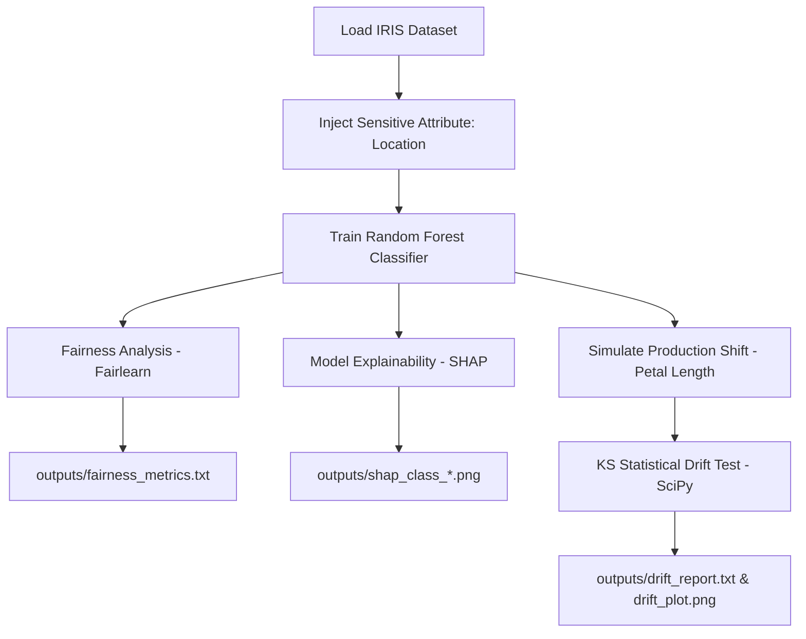

# 🌿 Responsible AI & MLOps Pipeline: IRIS Dataset
### Explainability, Fairness, and Data Drift Detection


---

## 📌 Overview

This repository branch contains the **Week 9 MLOps Assignment**, extending the classic **IRIS Machine Learning Pipeline** by incorporating core **Responsible AI** pillars. Moving beyond standard model accuracy, this project evaluates the trustworthiness, equity, and reliability of the model in production through:

* ⚖️ **Fairness & Demographic Parity** via `Fairlearn`
* 🔍 **Model Explainability & Feature Attribution** via `SHAP`
* 📉 **Production Data Drift Detection** via `Kolmogorov–Smirnov` statistical testing

> 📌 **Note:** A production-ready ML pipeline must not only deliver accurate predictions but also guarantee decision transparency, guard against demographic bias, and actively monitor incoming data for distribution shifts over time.

---

## 🎯 Assignment Objectives

* **Sensitive Attribute Integration:** Introduce a synthetic demographic feature (`location`) to evaluate model bias without using it for training.
* **Fairness Audit:** Evaluate algorithmic equity across groups using Fairlearn's `MetricFrame`.
* **Interpretability Analysis:** Generate SHAP (SHapley Additive exPlanations) summary plots for each IRIS species.
* **Data Drift Simulation:** Perturb production data distributions and detect shift using two-sample Kolmogorov–Smirnov (KS) statistical tests.
* **Artifact Generation:** Save output reports and visualizations to document pipeline audit findings.

---

## 🛠️ Technology Stack & Dependencies

| Category | Tools & Libraries |
| :--- | :--- |
| **Language & Environment** | Python 3.x, Google Cloud Platform (Cloud Shell Editor) |
| **Core ML & Data Science** | `scikit-learn`, `pandas`, `numpy`, `scipy` |
| **Explainability & Fairness** | `shap`, `fairlearn` |
| **Visualization** | `matplotlib`, `seaborn` |

---

## 📁 Repository Structure

```tree
22f3002843_MLOPS_WEEKLY_ASSIGNMENT
├── outputs/
│   ├── fairness_metrics.txt      # Fairlearn MetricFrame evaluation report
│   ├── shap_class_0.png          # SHAP summary plot for Setosa
│   ├── shap_class_1.png          # SHAP summary plot for Versicolor
│   ├── shap_class_2.png          # SHAP summary plot for Virginica
│   ├── drift_report.txt          # Statistical KS test results for data drift
│   └── drift_plot.png            # Distribution comparison histogram
├── README.md                     # Project documentation
├── requirements.txt              # Python dependencies manifest
├── fairness_analysis.py          # Script for sensitive attribute creation & fairness auditing
├── shap_analysis.py              # Script for SHAP tree explainer & plot generation
└── drift_detection.py            # Script for drift simulation & statistical testing
```

---

## ⚙️ Pipeline Components & Scripts

### 1. ⚖️ `fairness_analysis.py`
Evaluates demographic parity and accuracy parity across sensitive groups.
* **Functionality:**
  1. Loads the IRIS dataset.
  2. Injects a randomized binary **Location** attribute ($0$ or $1$) to act as a protected demographic feature.
  3. Excludes `location` from training and fits a `RandomForestClassifier` on the $4$ original IRIS features.
  4. Computes fairness metrics across groups using `Fairlearn`'s `MetricFrame` (Accuracy, Precision, Recall).
  5. Exports metric comparisons to `outputs/fairness_metrics.txt`.

---

### 2. 🔍 `shap_analysis.py`
Provides global and local feature attribution for model predictions.
* **Functionality:**
  1. Fits a `RandomForestClassifier` on IRIS feature data.
  2. Initializes a SHAP `TreeExplainer` and computes SHAP values across test samples.
  3. Renders species-specific SHAP summary plots highlighting feature impact and directionality.
  4. Exports plots to `outputs/shap_class_0.png`, `outputs/shap_class_1.png`, and `outputs/shap_class_2.png`.

---

### 3. 📉 `drift_detection.py`
Simulates live inference data shift and performs hypothesis testing for distribution drift.
* **Functionality:**
  1. Ingests baseline IRIS training data.
  2. Simulates production drift by applying a positive shift perturbation to `Petal Length`.
  3. Conducts two-sample **Kolmogorov–Smirnov (KS) statistical tests** comparing baseline vs. production distributions.
  4. Generates distribution overlay histograms (`outputs/drift_plot.png`) and writes statistical summaries (`outputs/drift_report.txt`).

---

## 🔄 End-to-End Pipeline Architecture



---

## 📊 Summary of Results & Key Findings

### ⚖️ 1. Fairness Audit (`outputs/fairness_metrics.txt`)
* **Setup:** Injected `location` ($0$ vs $1$) as a sensitive attribute without including it in feature matrix $X$.
* **Metrics Evaluated:** Accuracy, Precision, Recall via `MetricFrame`.
* **Finding:** Metric values were identical ($1.00$) across both Location groups. This confirms zero algorithmic bias or performance disparity, as expected from an un-correlated synthetic attribute.

### 🔍 2. Explainability & Feature Importance (`outputs/shap_class_*.png`)
* **Setosa & Versicolor (`shap_class_0.png`, `shap_class_1.png`):** Clearly delineates key separation boundary rules.
* **Virginica (`shap_class_2.png`):**
  * **Petal Length** is the single most influential feature pushing model predictions toward Virginica.
  * **Petal Width** is the secondary driver.
  * **Sepal Length** and **Sepal Width** exhibit minor influence on prediction outcome.

### 📉 3. Data Drift Detection (`outputs/drift_report.txt` & `outputs/drift_plot.png`)
* **Simulation:** Perturbed `Petal Length` values in incoming inference batches.
* **Statistical Finding:** The two-sample KS test correctly flagged **Petal Length** as drifted ($p < 0.05$), while confirming that all other feature distributions remained invariant.

---

## 🎓 Key Learnings & MLOps Governance Takeaways

* **Explainable AI (XAI):** SHAP values provide granular, sample-level proof of feature attributions, building stakeholder trust before production deployment.
* **Algorithmic Fairness:** Auditing model performance across sensitive groups using `Fairlearn` prevents unintended disparate impact.
* **Statistical Monitoring:** Continuous monitoring via non-parametric tests (e.g., Kolmogorov–Smirnov) detects data drift before model degradation impacts real-world applications.
* **Responsible AI Governance:** Comprehensive model assessment requires a holistic evaluation framework combining accuracy, equity, explainability, and drift resilience.

---

## 🚀 Quick Start Guide

### Prerequisites
Ensure Python 3.8+ is installed on your system or GCP Cloud Shell instance.

### 1. Clone & Navigate
```bash
git clone <repository-url>
cd 22f3002843_MLOPS_WEEKLY_ASSIGNMENT
```

### 2. Environment Setup
Install required dependencies:
```bash
pip install -r requirements.txt
```

### 3. Pipeline Execution
Run the individual analysis scripts in order:

```bash
# 1. Execute Fairness Evaluation
python fairness_analysis.py

# 2. Generate SHAP Explainability Plots
python shap_analysis.py

# 3. Perform Data Drift Detection
python drift_detection.py
```

> 💡 **Tip:** All visual assets and report text files will be automatically generated and updated inside the `outputs/` directory.

---

## 📝 Conclusion

This repository illustrates an end-to-end **Responsible Machine Learning Pipeline** on the IRIS dataset. Beyond achieving high predictive precision, the pipeline establishes a framework for auditing fairness, explaining individual predictions, and continuously monitoring production data streams—key pillars of modern MLOps governance.
