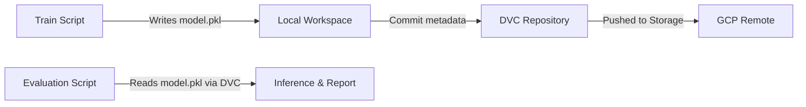
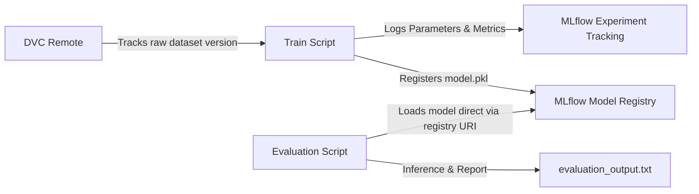

# 🌸 Iris Classification ML Pipeline with MLflow & GCP

[](https://www.python.org/)
[](https://mlflow.org/)
[](https://cloud.google.com/)
[](https://dvc.org/)
[](https://scikit-learn.org/)

An end-to-end MLOps pipeline for classifying Iris flowers, featuring **MLflow** for experiment tracking, hyperparameter tuning, and model registry, integrated within a **Google Cloud Platform (GCP)** environment.

---

## Table of Contents
- [Overview](#overview)
- [Assignment Objectives](#assignment-objectives)
- [Repository Structure](#repository-structure)
- [System Architecture & DVC Changes](#system-architecture--dvc-changes)
- [Hyperparameter Tuning & Experiment Tracking](#hyperparameter-tuning--experiment-tracking)
- [MLflow Visualizations](#mlflow-visualizations)
- [MLflow Model Registry](#mlflow-model-registry)
- [File Walkthrough](#file-walkthrough)
- [Setup & Cloud Environment](#setup--cloud-environment)
- [Troubleshooting & Port Conflicts](#troubleshooting--port-conflicts)
- [Learning Outcomes](#learning-outcomes)

---

## Overview

This repository contains the solution for the **Week 5 MLOps Assignment**, focused on integrating **MLflow** into the existing IRIS Machine Learning pipeline. 

Previously, the pipeline relied on **DVC** for both dataset and model versioning, using **GitHub Actions** for Continuous Integration. In this iteration, the pipeline's architecture was updated to separate concerns:
* **DVC** is now responsible solely for **data versioning**.
* **MLflow** takes over **experiment tracking, hyperparameter logging, model artifact storage, and model versioning/registry**.

The entire pipeline was built, tracked, and evaluated inside the **Google Cloud Platform (GCP) Cloud Shell Code Editor**.

---

## Assignment Objectives

- [x] **MLflow Integration:** Integrate MLflow tracking and registry API into the training and evaluation pipelines.
- [x] **Hyperparameter Tuning:** Conduct multiple experiments to tune Random Forest hyperparameters.
- [x] **Experiment Tracking:** Log training parameters (`n_estimators`, `max_depth`) and metrics (`Accuracy`, `Precision`, `Recall`).
- [x] **Model Registry:** Register trained models with the MLflow Model Registry.
- [x] **DVC Decoupling:** Decouple model artifacts from DVC, keeping DVC dedicated strictly to dataset tracking.
- [x] **Direct Registry Loading:** Update the evaluation pipeline to load models directly from the MLflow Model Registry via URIs.

---

## Repository Structure

```text
.
├── train.py                 # Training and experiment sweep logging script
├── evaluate.py              # Registry model loading and evaluation script
├── evaluation_output.txt    # Console output from evaluate.py
├── README.md                # Project documentation
└── .gitignore               # Files excluded from git tracking
```

---

## System Architecture & DVC Changes

We transitioned from a DVC-hosted model storage system to an MLflow-hosted model registry system. This separates data lineage from model training runs.

### Pipeline Evolution

#### Previous Pipeline (DVC-Centric)


#### Updated Pipeline (MLflow Model Registry)


---

## Hyperparameter Tuning & Experiment Tracking

The training script (`train.py`) executes a grid of Random Forest configurations to find the optimal combination. 

### Experiment Configurations

The following three runs were performed as part of the `Iris_Classification_Experiment`:

| Run Name | `n_estimators` | `max_depth` | Logged Metrics | Model Registered? |
| :--- | :---: | :---: | :--- | :---: |
| `rf_run_config_0` | 10 | 3 | Accuracy, Precision, Recall | Yes (Version 1) |
| `rf_run_config_1` | 50 | 5 | Accuracy, Precision, Recall | Yes (Version 2) |
| `rf_run_config_2` | 100 | 7 | Accuracy, Precision, Recall | Yes (Version 3) |

For every training run, MLflow automatically tracks:
* **Parameters:** `n_estimators`, `max_depth`
* **Metrics:** `Accuracy`, `Precision`, `Recall`
* **Artifacts:** `model.pkl` (the serialized Scikit-Learn model)
* **Metadata:** Training time, source git commit, user name, and runtime platform.

---

## MLflow Visualizations

The MLflow UI offers graphical analysis tools to compare the performance profiles of hyperparameter spaces. During experiment analysis, the following visualizations were leveraged:

* **Parallel Coordinates Plot:** Displays the multi-dimensional relationships between hyperparameters (`max_depth`, `n_estimators`) and the target performance metric (`accuracy`). This plot helps identify that the run with `max_depth = 5.0` and `n_estimators = 50.0` yielded a lower accuracy, while other configurations achieved peak accuracy.
* **Contour Plot:** Maps the performance landscape in 2D space. The light-shaded central region reveals the optimal hyperparameter bounds, illustrating how variation in estimator counts and tree depth impacts the model's accuracy.

---

## MLflow Model Registry

Instead of manually deploying or referencing physical paths, models are managed through the Centralized MLflow Model Registry under the registered name:

```text
Iris_RandomForest_Model
```

The Model Registry manages version history, metadata, and lifecycle stages for our configurations:
* **Version History:** Three consecutive runs (`rf_run_config_0`, `rf_run_config_1`, and `rf_run_config_2`) were successfully registered as **Version 1**, **Version 2**, and **Version 3** respectively.
* **Lifecycle Tracking:** Facilitates tracking models from staging/production aliases and loading them directly into the evaluation pipeline using structured URIs (e.g., `models:/Iris_RandomForest_Model/1`).

---

## File Walkthrough

### 🧪 [train.py](train.py)
This script orchestrates the model training and hyperparameter sweep:
* **Dataset Loading & Splitting:** Ingests the Iris dataset and splits it into training and validation sets.
* **Hyperparameter Tuning:** Systematically sweeps across combinations of Random Forest parameters (`n_estimators` and `max_depth`).
* **Experiment Tracking:** Initiates MLflow runs inside the `Iris_Classification_Experiment` to log metrics, parameters, and model artifacts.
* **Model Registry:** Automatically registers successfully trained models to the Centralized Model Registry under the name `Iris_RandomForest_Model`.

### 📊 [evaluate.py](evaluate.py)
This script performs final evaluation and validation on test data:
* **Direct Registry Loading:** Loads the model directly from the MLflow Model Registry via the production-ready URI: `models:/Iris_RandomForest_Model/1`.
* **Decoupled Workflows:** Avoids local `.pkl` file dependencies entirely, enabling remote and containerized evaluations.
* **Inference & Logging:** Runs test inference and generates a standardized classification report.

### 📝 [evaluation_output.txt](evaluation_output.txt)
Captures the console output of the final evaluation pipeline run, validating model performance and classification metrics on unseen test data.

---

## Setup & Cloud Environment

### Tech Stack
* **Cloud Infrastructure:** Google Cloud Platform (GCP)
* **IDE:** GCP Cloud Shell Editor
* **Runtime:** Python 3.x
* **Core Libraries:** `mlflow`, `pandas`, `scikit-learn`, `joblib`

### Running the Project Locally

1. **Clone the Repository:**
   ```bash
   git clone <repo_url>
   cd iris-mlflow-pipeline
   ```
2. **Install Dependencies:**
   ```bash
   pip install -r requirements.txt
   ```
3. **Run Training & Logging:**
   ```bash
   python train.py
   ```
4. **Run Model Evaluation:**
   ```bash
   python evaluate.py
   ```

---

## Troubleshooting & Port Conflicts

During deployment, launching the MLflow UI inside Cloud Shell may lead to port conflicts due to dangling MLflow server processes.

> **💡 Tip:** To resolve port conflicts, terminate any active MLflow instances and launch a new server bound to a custom port.

1. **Find and kill any existing MLflow processes:**
   ```bash
   pkill -f mlflow
   ```
2. **Launch the MLflow UI on Port 8100:**
   ```bash
   mlflow ui \
     --host 0.0.0.0 \
     --port 8100 \
     --disable-security-middleware
   ```
3. **Web Preview:** Open the web preview in Cloud Shell and map the preview port to **8100** to access the MLflow dashboard.

---

## Learning Outcomes

> **⚠️ Important:** Key takeaways from this MLOps assignment:
> * **Decoupling Data & Model Tracking:** DVC is powerful for large datasets, but MLflow provides a superior environment for tracking experiment iterations, parameters, and versioning models.
> * **Automated Registry Workflows:** Loading model dependencies via URI tags (`models:/ModelName/Version`) removes hardcoded local paths, facilitating clean, reproducible deployment and evaluation.
> * **Visual Hyperparameter Optimization:** Using parallel coordinates and contour plots visually explains training trends, showing at a glance how hyperparameter selections interact to affect the objective metric.
