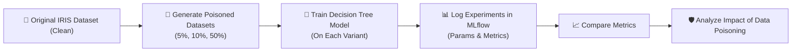

# 🛡️ MLSecOps IRIS Pipeline — Week 8 Assignment

[](https://github.com/)
[](https://github.com/)
[](https://www.python.org/)
[](https://mlflow.org/)
[](https://scikit-learn.org/)

> **Course:** MLOps – Week 8 Assignment  
> **Topic:** Integrating MLSecOps into the IRIS Pipeline  
> **Author:** Devansh Gupta (`22f3002843`)  
---

## 📌 Overview

This repository contains my **Week 8 MLOps assignment**, which focuses on integrating **MLSecOps (Machine Learning Security Operations)** into the IRIS machine learning pipeline.

The primary objective of this assignment is to understand how **data poisoning attacks** impact machine learning models by creating poisoned versions of the IRIS dataset, training models on datasets with different corruption levels, tracking experiments using **MLflow**, and analyzing the effect of data quality on model performance.

---

## 🎯 Assignment Objectives

- **MLSecOps Integration:** Understand the importance of security across the entire ML lifecycle.
- **Attack Simulation:** Simulate data poisoning attacks on the standard IRIS benchmark dataset.
- **Dataset Corruption:** Generate multiple poisoned datasets with varying corruption levels (5%, 10%, 50%).
- **Model Training:** Train a classification model (Decision Tree) on each dataset variant.
- **Experiment Tracking:** Track experiments, parameters, and evaluation metrics using **MLflow**.
- **Performance Evaluation:** Compare model performance across different poisoning levels.
- **Mitigation Defense:** Study defense and mitigation strategies against data poisoning attacks.
- **Quality vs. Quantity:** Understand the relationship between **data quality** and **data quantity**.

---

## 📂 Repository Structure

```text
22f3002843_MLOPS_WEEKLY_ASSIGNMENT/
├── 📁 data/
│   ├── 📄 iris_clean.csv          # Original IRIS dataset (0% baseline)
│   ├── 📄 iris_poisoned_5.csv     # 5% poisoned samples dataset
│   ├── 📄 iris_poisoned_10.csv    # 10% poisoned samples dataset
│   └── 📄 iris_poisoned_50.csv    # 50% poisoned samples dataset
├── 🐍 poison_dataset.py           # Data poisoning simulation script
├── 🐍 mlsecops_experiment.py      # Model training & MLflow experiment tracking script
├── 📄 requirements.txt            # Python dependencies
├── 📄 README.md                   # Assignment documentation
└── 📄 .gitignore                  # Git exclusions for MLflow & cache
```

---

## 📄 File Description

### 📁 `data/` Directory
Contains all dataset variants used during the experiment.

| File | Corruption Level | Description |
| :--- | :---: | :--- |
| `iris_clean.csv` | **0% (Baseline)** | Original IRIS dataset used as the clean baseline ground truth. |
| `iris_poisoned_5.csv` | **5%** | Dataset with 5% corrupted samples. |
| `iris_poisoned_10.csv` | **10%** | Dataset with 10% corrupted samples. |
| `iris_poisoned_50.csv` | **50%** | Dataset with 50% corrupted samples. |

---

### 🐍 `poison_dataset.py`
This script performs the data poisoning simulation.

#### Functionality
- Loads the original IRIS dataset.
- Preserves the clean dataset as the baseline (`iris_clean.csv`).
- Creates poisoned datasets with:
  - **5% corruption**
  - **10% corruption**
  - **50% corruption**
- Randomly replaces selected samples with:
  - Random feature values
  - Random class labels
- Saves all generated datasets into the **`data/`** directory.

---

### 🐍 `mlsecops_experiment.py`
This script performs model training and experiment tracking.

#### Functionality
- Loads each dataset variant from the `data/` directory.
- Trains a **Decision Tree Classifier**.
- Evaluates model performance.
- Logs each experiment using **MLflow**.
- Stores the following metrics:
  - **Accuracy**
  - **Precision**
  - **Recall**
  - **F1 Score**
- Records the poisoning level as an MLflow parameter.

---

### 📄 `requirements.txt`
Contains the Python dependencies required to execute the project:
- `pandas` — Data manipulation & handling
- `numpy` — Numerical computations
- `scikit-learn` — Decision Tree Classifier & evaluation metrics
- `mlflow` — Experiment tracking & logging

---

### 📄 `.gitignore`
Prevents unnecessary generated files from being uploaded to GitHub:
- MLflow artifacts & `mlruns/` directories
- Model binary files
- Python cache (`__pycache__/`)
- Virtual environments (`venv/`)
- Database files

---

## ⚙️ Implementation Workflow



---

## 🛡️ MLSecOps Concepts Covered

This assignment demonstrates key security and operational concepts:

- **Data Poisoning:** Injecting corrupted samples into training data to skew model learning.
- **Adversarial Examples:** Crafting small perturbations to fool inference predictions.
- **Model Extraction:** Querying public endpoints to reverse-engineer trained model parameters.
- **Prompt Injection:** Crafting prompt text to manipulate model instruction behavior.
- **Data Validation:** Pre-training checks on dataset values, types, and completeness.
- **Schema Enforcement:** Enforcing strict data format constraints during ingestion.
- **Statistical Validation:** Comparing feature distributions to detect distribution drift.
- **Anomaly Detection:** Outlier identification to isolate suspicious samples.
- **Data Provenance Tracking:** Maintaining full data lineage and source auditing.
- **Data Quality vs Data Quantity:** Demonstrating why clean data dominates raw sample volume.

---

## 📊 MLflow Experiment Tracking

Each experiment records:

### ⚙️ Parameters
- **Poisoning Level** (`0%`, `5%`, `10%`, `50%`)

### 📏 Metrics
- **Accuracy**
- **Precision**
- **Recall**
- **F1 Score**

The comparison view in **MLflow** is used to analyze how increasing corruption levels affect model performance.

---

## 📈 Dataset Variants

| Dataset | Corruption Level |
| :--- | :---: |
| **Clean Dataset** | `0%` |
| **Poisoned Dataset** | `5%` |
| **Poisoned Dataset** | `10%` |
| **Poisoned Dataset** | `50%` |

---

## 🧪 Model Used

- **Decision Tree Classifier** (`sklearn.tree.DecisionTreeClassifier`)

The exact same model architecture is trained on every dataset to ensure a fair comparison between poisoning levels.

---

## 🚀 How to Run

### 1. Install Dependencies
```bash
pip install -r requirements.txt
```

### 2. Generate Poisoned Datasets
```bash
python poison_dataset.py
```

### 3. Train Model & Log MLflow Experiments
```bash
python mlsecops_experiment.py
```

### 4. Launch MLflow UI
```bash
mlflow ui \
  --host 0.0.0.0 \
  --port 5000 \
  --allowed-hosts "*" \
  --cors-allowed-origins "*"
```
> Access the MLflow Web UI at `http://localhost:5000` (or via GCP Cloud Shell Web Preview on port 5000).

---

## 📚 Key Learnings

Through this assignment, I learned:

- The importance of securing machine learning pipelines across every lifecycle stage.
- How data poisoning affects model performance and decision boundaries.
- How MLflow simplifies experiment tracking, visualization, and comparison.
- Why validating data before training is essential for production security.
- The role of anomaly detection and provenance tracking in MLSecOps.
- Why clean data is more valuable than simply collecting larger quantities of data.

---

## ✅ Assignment Deliverables

- [x] **Data Poisoning Simulation**
- [x] **Clean and Poisoned IRIS Datasets**
- [x] **MLflow Experiment Tracking**
- [x] **Model Performance Comparison**
- [x] **Security Threat Analysis**
- [x] **Mitigation Strategy Discussion**
- [x] **GitHub Repository with Source Code and Documentation**

---
