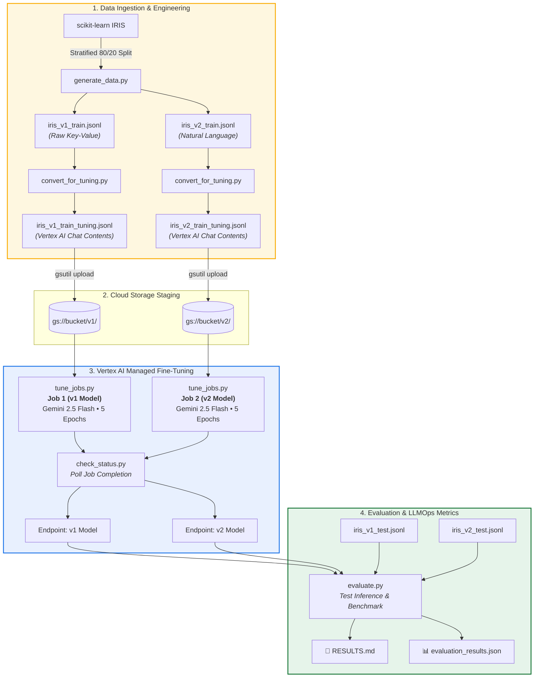

<div align="center">

# 🌺 From MLOps to LLMOps: Fine-Tuning Gemini on the IRIS Pipeline
### Supervised Fine-Tuning (SFT) & Comparative Evaluation of Data Representations on Google Cloud Vertex AI

[](https://www.python.org/)
[](https://cloud.google.com/vertex-ai)
[](https://deepmind.google/technologies/gemini/)
[](https://github.com/IITMBSMLOps/ga_resources/tree/week_10)
[]()

<p align="center">
  <b>Week 10 Assignment — MLOps Weekly Series</b><br>
  <i>Investigating whether natural language encapsulation improves LLM classification performance over raw feature serialization on structured tabular datasets.</i>
</p>

[Overview](#-overview) • [LLMOps Architecture](#-llmops-pipeline-architecture) • [Dataset Representations](#-dataset-representations-v1-vs-v2) • [Results & Analysis](#-evaluation-results--benchmark) • [Repository Structure](#-repository-structure) • [Reproduction Guide](#-setup--reproduction) • [Key Insights](#-key-llmops-takeaways)

---

</div>

## 📌 Overview

Traditional **MLOps** centers on managing training code, tabular feature stores, and deterministic weight checkpoints. **LLMOps** shifts the operational discipline toward foundation models — where data is formatted as prompt-response pairs, model adaptation happens via Supervised Fine-Tuning (SFT) adapters, and evaluation must account for generative failure modes such as **format hallucination** and **malformed syntax**.

### 🎯 The Core Experiment
> **Does translating structured numerical tabular data into natural language prompts improve the classification capability of a fine-tuned LLM?**

To test this hypothesis, the standard **Fisher's IRIS dataset** was serialized into two distinct representations and trained on Google Cloud Vertex AI using **`gemini-2.5-flash`** under strictly controlled, identical hyperparameters.

```
┌──────────────────────────────────────────────────────────────────────────┐
│  Controlled Variable: Data Representation (v1 Raw vs. v2 Natural Lang)  │
│  Fixed Variables: Base Model (gemini-2.5-flash), Epochs (5), LR Mult (1.0) │
│  Evaluation Split: 80% Train (120 samples) / 20% Held-Out Test (30 samples)│
└──────────────────────────────────────────────────────────────────────────┘
```

---

## 🏗️ LLMOps Pipeline Architecture

The end-to-end lifecycle spans automated dataset synthesis, format normalization for Vertex AI SFT, asynchronous tuning orchestration, endpoint discovery, and multi-dimensional LLM evaluation.



---

## 🔬 Dataset Representations: v1 vs. v2

Both datasets were derived from the same stratified split to eliminate sampling bias.

### 🔹 Version 1: Raw Feature Representation (`v1`)
Direct serialization of numerical measurements and feature column names. Concise, high token density.

```json
{
  "input_text": "sepal_length: 5.1, sepal_width: 3.5, petal_length: 1.4, petal_width: 0.2",
  "output_text": "setosa"
}
```

### 🔹 Version 2: Natural Language Representation (`v2`)
Full descriptive English sentences framing the classification query in conversational context.

```json
{
  "input_text": "A flower specimen has a sepal length of 5.1 cm, sepal width of 3.5 cm, petal length of 1.4 cm, and petal width of 0.2 cm. Identify the iris species.",
  "output_text": "This is Iris setosa."
}
```

### ⚙️ Vertex AI API Format Conversion
The assignment's foundational format (`input_text`/`output_text`) was converted by [`convert_for_tuning.py`](./convert_for_tuning.py) to meet the modern Vertex AI multi-turn SFT specification:

```json
{
  "contents": [
    {"role": "user", "parts": [{"text": "..."}]},
    {"role": "model", "parts": [{"text": "..."}]}
  ]
}
```

---

## 📊 Evaluation Results & Benchmark

Evaluation was performed across 30 held-out test samples (10 per class) comparing classification precision, recall, macro F1, and LLM-specific **Format Compliance**.

### 🏆 Head-to-Head Comparison

| Metric | 🏷️ v1 — Raw Feature Format | 💬 v2 — Natural Language Format | Delta (v1 vs v2) |
| :--- | :---: | :---: | :---: |
| **Overall Accuracy** | **`56.7%` (17/30)** | `40.0%` (12/30) | **+16.7%** 🚀 |
| **Format Compliance** | **`100.0%`** | **`100.0%`** | `0.0%` |
| **Macro Precision** | **`0.72`** | `0.47` | **+0.25** |
| **Macro Recall** | **`0.57`** | `0.40` | **+0.17** |
| **Macro F1-Score** | **`0.52`** | `0.38` | **+0.14** |
| **Setosa Recall** | **`1.00`** (10/10) | **`1.00`** (10/10) | `0.00` |
| **Versicolor Recall** | **`0.20`** (2/10) | `0.00` (0/10) | **+0.20** |
| **Virginica Recall** | **`0.50`** (5/10) | `0.20` (2/10) | **+0.30** |

> 🥇 **Experiment Conclusion:** **Version 1 (Raw Feature Format) is the clear winner**, outperforming natural language prompts by **16.7 percentage points** in overall accuracy.

---

## 🔍 In-Depth LLMOps Analysis

```
  Accuracy Comparison
  ─────────────────────────────────────────────────────────────
  v1 (Raw Features)        [█████████████████████░░░░░░░░] 56.7%
  v2 (Natural Language)    [███████████████░░░░░░░░░░░░░░] 40.0%
  ─────────────────────────────────────────────────────────────
  Format Compliance (Both) [█████████████████████████████] 100.0%
```

### 1. Token Signal vs. Prompt Bloat on Small Datasets ($N=120$)
- In low-sample fine-tuning regimes, conversational filler words (`"A flower specimen has a..."`, `"Identify the iris species"`) dilute parameter gradient updates across non-informative tokens.
- **v1 Raw** keeps attention concentrated directly on the numerical values and dimension identifiers, leading to sharper class boundary learning.

### 2. Format Compliance $\neq$ Factual Accuracy
- Both models achieved **100% Format Compliance** (every single output adhered strictly to the expected schema without markdown artifacts or hallucinations).
- **Critical LLMOps Insight:** In LLM evaluation, syntax validity is a prerequisite, not proof of correctness. A traditional classifier cannot emit unparseable output, whereas LLMs require explicit dual-metric monitoring (Syntax Validity + Label Correctness).

### 3. Non-Linear Decision Boundaries (Versicolor vs. Virginica)
- Both models easily achieved **100% recall on Setosa** (which is linearly separable by petal measurements).
- The overlapping distributions of *Versicolor* and *Virginica* proved challenging for few-shot SFT; however, **v1** maintained discriminative capacity (0.50 Virginica / 0.20 Versicolor recall) while **v2** collapsed on Versicolor (0.00 recall).

---

## 📂 Repository Structure

```
├── 📁 data/
│   ├── iris_v1_train.jsonl          # v1 raw training set (input_text/output_text)
│   ├── iris_v1_test.jsonl           # v1 held-out evaluation set
│   ├── iris_v1_train_tuning.jsonl   # v1 Vertex AI multi-turn contents format
│   ├── iris_v2_train.jsonl          # v2 natural language training set
│   ├── iris_v2_test.jsonl           # v2 held-out evaluation set
│   └── iris_v2_train_tuning.jsonl   # v2 Vertex AI multi-turn contents format
├── 📄 generate_data.py              # Stratified split & JSONL dataset builder
├── 📄 convert_for_tuning.py         # Legacy format -> Vertex AI SFT schema adapter
├── 📄 tune_jobs.py                  # Orchestrates parallel Gemini 2.5 SFT jobs on Vertex AI
├── 📄 check_status.py               # Asynchronous job poller & endpoint resolver
├── 📄 evaluate.py                   # Generates evaluation_results.json and RESULTS.md
├── 📊 evaluation_results.json       # Structured benchmark outputs & metadata
├── 📝 RESULTS.md                    # Comprehensive performance report
├── ⚙️ requirements.txt              # Project dependencies
└── 📖 README.md                     # Project documentation & operational guide
```

---

## 🚀 Setup & Reproduction

### 1️⃣ Prerequisites & Cloud Setup
Ensure you have Google Cloud SDK installed and authenticated with your project:

```bash
# Set GCP Project
gcloud config set project <YOUR_PROJECT_ID>

# Enable Vertex AI and Cloud Storage APIs
gcloud services enable aiplatform.googleapis.com storage.googleapis.com
```

### 2️⃣ Install Dependencies
```bash
pip install -r requirements.txt
```

### 3️⃣ Data Generation & Format Conversion
```bash
# Generate v1 and v2 raw JSONL datasets
python3 generate_data.py

# Convert datasets to Vertex AI SFT schema
python3 convert_for_tuning.py

# Stage tuning datasets on Google Cloud Storage
gsutil cp data/iris_v1_train_tuning.jsonl gs://<YOUR_BUCKET>/v1/
gsutil cp data/iris_v2_train_tuning.jsonl gs://<YOUR_BUCKET>/v2/
```

### 4️⃣ Submit Supervised Fine-Tuning Jobs
```bash
python3 tune_jobs.py
```

### 5️⃣ Monitor Training & Retrieve Endpoints
```bash
python3 check_status.py
```

### 6️⃣ Run Evaluation & Benchmark Reports
```bash
# Run held-out test inference and generate RESULTS.md & evaluation_results.json
python3 evaluate.py
```

---

## 💡 Key LLMOps Takeaways

| Dimension | ⚙️ Traditional MLOps | 🧠 LLMOps (This Experiment) |
| :--- | :--- | :--- |
| **Input Format** | Dense numerical feature tensors | Formatted JSONL text pairs (`input_text`/`output_text`) |
| **Model Adaptation** | Train weights from scratch (e.g. Random Forest, MLP) | Supervised Fine-Tuning (SFT) on foundation models (`gemini-2.5-flash`) |
| **Compute & Pipeline** | Local / Custom training clusters | Cloud-managed SFT jobs on Vertex AI |
| **Failure Modes** | High bias/variance, metric regression | Format hallucination, malformed strings, token noise |
| **Evaluation Scope** | Standard confusion matrix & accuracy | Dual-layer: **Format Compliance Rate** + **Classification Metrics** |
| **Versioning** | Model weights (`.pkl`, `.onnx`) + datasets | Prompts, Adapter checkpoints, SFT JSONL schemas |

---

## 👤 Author & Assignment Metadata

- **Student Roll Number:** `22f3002843`
- **Course:** IIT Madras BS in Data Science & Applications — MLOps
- **Assignment:** Week 10 (From MLOps to LLMOps: IRIS Fine-Tuning on Vertex AI)
- **Target Branch:** `week_10`
- **Base Foundation Model:** `gemini-2.5-flash`

---

<div align="center">
  <sub>Developed as part of the IITM BS Degree MLOps Weekly Practicum. Built with Google Cloud Vertex AI & Gemini.</sub>
</div>
